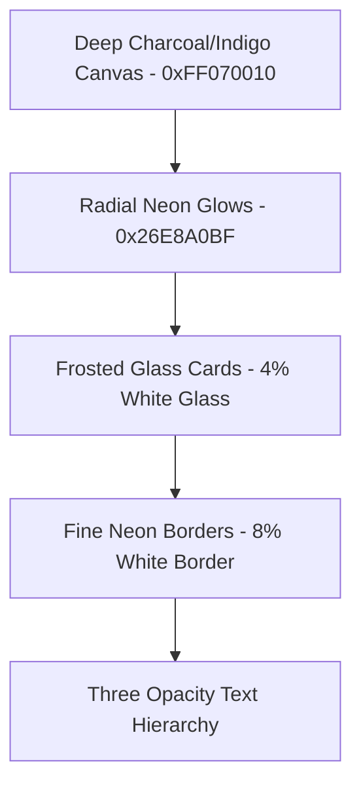

# Naam Smaran (नाम स्मरण) — Product Design & UI/UX Specification

> **जय श्री हित हरिवंश महाप्रभु 🙏 | श्री राधावल्लभ लाल की जय 🌸**
>
> This document serves as the absolute visual and design source of truth for **Naam Smaran**, a premium, offline personal devotional tracker. It is designed to be fed into **Stitch** and other high-fidelity design agents to generate, review, and iterate on visual systems, components, and layout variants.

---

## 1. Visual & Spiritual Identity

Naam Smaran is a highly customized, immersive devotional app for practitioners of the **Shri Hit Harivansh Mahaprabhu — Radhavallabh Sampraday**. The design must evoke deep, quiet devotion (**Sahchari Bhav**) through state-of-the-art modern dark-mode aesthetics, rich glassmorphism, and smooth micro-animations.

### The Sacred Visual World (Allowed Elements)
Every graphic asset, icon, background, and gradient must draw strictly from the sacred forest of Vrindavan:
*   **Aesthetic Scenes:** Nikunj (hidden bowers/groves of creepers), Yamuna pulin (sacred riverbanks), Vrindavan forest, Van Vihar (divine walks), and Sharad Purnima (autumn full moon nights).
*   **Fauna & Flora:** Peacock feathers or forms (Mor), parrots (Kir/Shuk), cuckoos (Pik), swans (Hans), creepers, pink and golden lotuses, Kadamba trees, Champak flowers, Bakul, Madhavi Lata, Malati, and Juhi.
*   **Divine Text (Devanagari):** "राधा", "हरिवंश", "राधावल्लभ", "गुरु कृपा केवलं".
*   **The Atmosphere:** A soft glowing bower with moonlight filtering through leaves, slow floating particles (orbs of golden light), and quiet, sacred intimacy (Tat-Sukh Bhav).

### Strict Prohibitions (Forbidden Elements)
> [!CAUTION]
> The following symbols and themes belong to different spiritual paths and **MUST NEVER** appear anywhere in the UI, backgrounds, assets, or icons. Their inclusion violates the sacred identity of the app:
> *   **No Om symbol (ॐ)**
> *   **No Trishul (trident), Rudraksha beads, Garuda, or Conch (Shankh)**
> *   **No Shiva or Durga imagery/references**
> *   **No generic temple architecture** (no shikhars, flags, or stone temples)
> *   **No Gaudiya Vaishnava symbols** (e.g., Tilak styles or temple motifs from other traditions)
> *   **No direct depiction of the deity forms** (Shri PriyaPriyatam) — instead, focus on Swamini's lotus feet, peacocks, creepers, and natural Vrindavan beauty.

---

## 2. Dribbble-Inspired Design Language

The UI fuses classical Indian devotional depth with high-end, premium digital design. It is directly inspired by elite Dribbble concepts featuring dark frosted glass layers, neon accent glows, and smooth transitions.



### The Design Tokens & Color Palettes
All UI elements reference a centralized theme system to ensure absolute visual consistency:

#### Palette A: Sharad Moon (Default Theme)
*   **Primary Background (`bgPrimary`):** `Color(0xFF070010)` — An extremely deep, velvet-like indigo-night sky.
*   **Primary Accent (`accentPrimary`):** `Color(0xFFE8A0BF)` — A soft, radiant rose-pink lotus.
*   **Secondary Accent (`accentSecondary`):** `Color(0xFFB8C8FF)` — Cold, beautiful moonlight blue.
*   **Gold Accent (`accentGold`):** `Color(0xFFF5CBA7)` — A warm, inviting soft champak-gold (used for warning/partial states).
*   **Radial Glow (`accentGlow`):** `Color(0x26E8A0BF)` — A 15% alpha soft neon pink aura hovering behind active content.

#### Palette B: Vrindavan Dawn
*   **Primary Background (`bgPrimary`):** `Color(0xFF0A0408)`
*   **Primary Accent (`accentPrimary`):** `Color(0xFFFFD4A3)` — Champak gold at sunrise.
*   **Secondary Accent (`accentSecondary`):** `Color(0xFFFFAAB5)` — Rose-pearl petals.
*   **Gold Accent (`accentGold`):** `Color(0xFFFFD700)` — Rich golden light.
*   **Radial Glow (`accentGlow`):** `Color(0x1FFFD4A3)` — 12% alpha golden dawn aura.

#### Palette C: Nikunj (The Sacred Bower)
*   **Primary Background (`bgPrimary`):** `Color(0xFF030A04)` — Deep emerald shadow.
*   **Primary Accent (`accentPrimary`):** `Color(0xFFA8E6CF)` — Fresh bower-creeper green.
*   **Secondary Accent (`accentSecondary`):** `Color(0xFFFFD4A3)` — Golden rays filtering through foliage.
*   **Gold Accent (`accentGold`):** `Color(0xFFC8E6A0)` — Pale lime-gold.
*   **Radial Glow (`accentGlow`):** `Color(0x1AA8E6CF)` — 10% alpha emerald bower aura.

### Glassmorphism & Elevation System
*   **No Heavy Drop Shadows:** Depth is generated using soft frosted layers and background blurs (`RenderEffect` on Android, backdrop-filter in web/Stitch).
*   **Standard Glass Card Modifier:**
    ```
    Background: Color(0x0AFFFFFF) — 4% pure white glass
    Border: 1dp, Color(0x14FFFFFF) — 8% white glass outline
    Corner Radius: 24dp (never less than 12dp for cards)
    Blur: 20dp background blur
    ```
*   **Interactive Scale:** Buttons use a `14dp` corner radius. Interactive chips use a fully rounded capsule shape (`999dp`).

### Strict Text Opacity Hierarchy
To prevent visual clutter, the text system enforces exactly three levels of opacity:
1.  **Primary Text (100%):** `Color(0xFFFFFFFF)` — Used for counts, active names, titles.
2.  **Secondary Text (65%):** `Color(0xA6FFFFFF)` — Used for sub-labels, descriptions, units.
3.  **Tertiary Text (38%):** `Color(0x61FFFFFF)` — Used for timestamps, inactive states, hints.
*(No other opacities or shades of gray are allowed).*

---

## 3. Core App Layout & Interactive Mechanics

The app operates in an **immersive fullscreen canvas** that completely hides the OS status and navigation bars. Users can summon system controls with transient edge-swiping, keeping 100% of the screen dedicated to the devotional experience.

```
+-------------------------------------------------------------+
|                                                             |
|                       GREETING HEADER                       |
|                       "राधे राधे"                           |
|                                                             |
|                                                             |
|                                                             |
|                          COUNTER                            |
|                          "21,600"                           |
|                                                             |
|                                                             |
|                                                             |
|                                                             |
|                                                             |
|                                                             |
|                                                             |
|     (TAP AREA: Fullscreen tap to count Radha Naam Jap)       |
|                                                             |
|  +-------------------------------------------------------+  |
|  |             QUICK-ACTIONS GLASS DOCK                  |  |
|  |    +108   |   +1,000   |   +5,000   |  View Dashboard |  |
|  +-------------------------------------------------------+  |
+-------------------------------------------------------------+
```

### The Zero-UI "Darshan" Mode & Resting Counter Slide
*   **Resting State:** When the user is idle, a massive, elegantly typeset counter sits dead-center in Devanagari numerals or high-contrast sans-serif, with the greeting `"राधे राधे"` floating above it.
*   **Chanting Action:** As the user taps the screen continuously to chant, the counter smoothly executes a dual-motion:
    1.  **Bias Alignment Slide:** Translates from center `(0f, 0f)` to the bottom-left corner `(-0.85f, 0.75f)`.
    2.  **Anchor Scale-Down:** Shrinks from `1.0f` to `0.65f`, anchoring its pivot to the bottom-left `(0f, 1f)`.
    3.  **Visual Fade-out:** The greeting text and target fractions fade away completely (`alpha = 0f`), leaving the entire center screen open for a full "darshan" showreel of Vrindavan artwork.
*   **Reset Cooldown:** After **5 seconds of inactivity**, the counter floats back gracefully to the center, restoring the full text displays.

### The Glass Bottom Sheet (Devotional Dashboard)
Swiping up from the bottom edge pulls up a heavy frosted-glass dashboard.
*   **Three Stages:**
    1.  `Hidden`: Hidden below the fold, showing only the resting screen.
    2.  `QuickActions`: An ultra-slim dock showing quick-add buttons (`+108`, `+1,000`, `+5,000`) and a drag handle.
    3.  `FullGrid`: Fully expanded dashboard presenting all **7 devotional sections** in a clean, highly structured list or grid.
*   **Flick & Drag:** The entire surface of the sheet acts as a gesture container, allowing fluid swipe-up and swipe-down transitions with responsive spring physics.

---

## 4. The 7 Devotional Sections & Target Progression

Naam Smaran contains exactly **7 devotional sections**. Each section represents a specific sadhana (spiritual practice) and uses custom mathematical formulas to adjust the next day's targets based on performance.

```
+-----------------------------------------------------------------------------------+
| DEVOTIONAL SECTIONS DASHBOARD                                                     |
+-----------------------------------------------------------------------------------+
|                                                                                   |
|  [1] नाम जप (Naam Jap)                                                            |
|      Track A: हरिवंश (11 Mala)  --- [ Progress: 11 / 11 ]  [ Completed - Rose ]   |
|      Track B: राधा (21,600 Jap) --- [ Progress: 20 / 21600] [ Partial - Gold ]     |
|                                                                                   |
|  [2] श्री हित चतुरसी जी (Chaturasi Ji)                                              |
|      12 Pads --- [ Progress: 0 / 12 ]                      [ Incomplete ]         |
|                                                                                   |
|  [3] श्री हित राधा सुधानिधी जी (Sudhanidhi Ji)                                      |
|      10 Shlokas --- [ Progress: 10 / 10 ]                  [ Completed - Rose ]   |
|                                                                                   |
|  [4] श्री हित सेवक वाणी (Sevak Vaani)                                              |
|      5 Chhands --- [ Progress: 2 / 5 ]                     [ Partial - Gold ]     |
|                                                                                   |
|  [5] अष्टयाम सेवा पद्धति (Ashtayam Seva)                                           |
|      8-Period checklist --- [ Mangala, Raj Bhog... ]        [ Flexible ]           |
|                                                                                   |
|  [6] नित्य पाठ रसोपासना (Nitya Path)                                               |
|      Daily Toggle --- [ Done / Not Done ]                  [ Streak Map ]         |
|                                                                                   |
|  [7] श्री वृंदावन शत लीला (Shat Leela)                                            |
|      10 Chhands --- [ Progress: 10 / 10 ]                  [ Completed - Rose ]   |
|                                                                                   |
+-----------------------------------------------------------------------------------+
```

### Visual Status Indicators (Three-State UI)
Each sadhana card on the dashboard must visually reflect its completion state:
1.  **Complete (`did >= target`):** A soft, glowing rose-pink background (`accentPrimary`) with white text.
2.  **Partial (`0 < did < target`):** Rendered in a warm, rich champak-gold outline (`accentGold`) with gold-tinted progress indicators to indicate progress is active but the goal has not yet been reached.
3.  **Incomplete (`did == 0`):** Transparent glass card with tertiary white outlines and text.

---

### Section Specifications

#### Section 1: नाम जप (Naam Jap — Dual-Track)
This section contains **two separate devotional tracks** run by distinct math engines:
*   **Track A ("राधावल्लभ श्री हरिवंश" Mala Tracker):**
    *   **Unit:** माला (Mala = 108 repetitions each).
    *   **Daily Target:** 11 Mala base.
    *   **Met Reward:** If target is met, the next day's target increases by **+5 or +6 Mala** (alternating/randomized).
    *   **Deficit Carry-over:** If missed, the incomplete Mala deficit is added directly to the next day's target.
*   **Track B ("राधा" Repetitions Counter):**
    *   **Unit:** Count (individual mental repetitions).
    *   **Daily Target:** 21,600 baseline (adjustable in settings).
    *   **Met Reward:** If target is met, the next day's target escalates by **+5,000 Jap** added to the *actual* amount chanted.
    *   **Deficit Carry-over:** If missed, the app carries over the remaining count and doubles the deficit.
    *   **Track B Mathematical Formula:**
        $$\text{Target}_{n+1} = \begin{cases} 
        \text{Done}_n + 5000 & \text{if } \text{Done}_n \ge \text{Target}_n \\
        \text{Target}_n + (\text{Target}_n - \text{Done}_n) & \text{if } \text{Done}_n < \text{Target}_n 
        \end{cases}$$
        *Example (Partial Bug Fix):* If target is 21,600 and the user chants only 20, they did not reach the target. The card is marked **Partial** (Gold), and the next day's target is calculated as: $21,600 + (21,600 - 20) = 43,180$ (no met reward added).

---

#### Section 2: श्री हित चतुरसी जी (Chaturasi Ji)
*   **Content:** The principal 84 devotional pads written in Brajbhasha by Shri Hit Harivansh Mahaprabhu.
*   **Daily Target:** 12 pads base.
*   **Met Reward:** If met, next day target increases by **+6 pads**.
*   **Carry-over Missed Pattern:**
    $$\text{Target}_{n+1} = \text{Remaining}_n + \text{Base Target}$$
    *Example:* Target is 12 pads, user reads 7. The remaining 5 pads are carried over, making tomorrow's target $5 + 12 = 17$ pads.
*   **UI Details:** Clean list of checkable pads with expandable text sheets showing the Brajbhasha poetry. Once pad 84 is finished, the cycle loops back to pad 1.

---

#### Section 3: श्री हित राधा सुधानिधी जी (Sudhanidhi Ji)
*   **Content:** Devotional Sanskrit verses dedicated to the lotus feet of Shri Radha.
*   **Daily Target:** 10 shlokas base (read with full translation/meaning).
*   **Met Reward:** +5 shlokas next day.
*   **Missed Pattern:** Carry-over pattern (remaining + new base).
*   **UI Details:** Clean side-by-side Sanskrit and Hindi translations in elegant serif typography with an expandable reflections/journaling drawer.

---

#### Section 4: श्री हित सेवक वाणी (Sevak Vaani)
*   **Content:** Devotional verses by Sevak Ji describing Nikunj pastimes.
*   **Daily Target:** 5 chhands base (with meaning).
*   **Met Reward:** +2 chhands next day.
*   **Missed Pattern:** Carry-over pattern (remaining + new base).

---

#### Section 5: अष्टयाम सेवा पद्धति (Ashtayam Seva Checklist)
*   **Content:** The 8-fold daily devotional schedule of bower service (Seva).
*   **Target:** Flexible. Minimum 3 completed service periods per day. No escalation or mathematical deficit compounding.
*   **The 8 Seva Periods:**
    1.  **Mangala (मङ्गला):** Waking the Divine Couple (Dawn, 4:00 AM - 6:00 AM)
    2.  **Shringar (शृङ्गार):** Dressing and adornment (6:00 AM - 8:00 AM)
    3.  **Gwal (ग्वाल):** Playful morning pastures (8:00 AM - 10:00 AM)
    4.  **Raj Bhog (राजभोग):** Feast at noon (10:00 AM - 1:00 PM)
    5.  **Utthapan (उत्थापन):** Waking from afternoon rest (3:30 PM - 4:30 PM)
    6.  **Bhog (भोग):** Evening snacks & light offerings (4:30 PM - 5:30 PM)
    7.  **Sandhya (सन्ध्या):** Twilight offering of lights/Aarti (5:30 PM - 7:00 PM)
    8.  **Shayan (शयन):** Putting the Divine Couple to rest (Night, 7:00 PM - 9:00 PM)
*   **Visual Dynamic:** The home screen's background scene changes color and tone dynamically based on the current system time matching these 8 periods (e.g., warm golden during Dawn, deep shadow during Raj Bhog, twilight violet during Sandhya, and moonlight-silver indigo during Shayan).

---

#### Section 6: नित्य पाठ रसोपासना (Daily Nitya Path Toggle)
*   **Content:** Standard daily devotional readings.
*   **Target:** Binary toggle (Completed / Not Completed). No escalation.
*   **UI Details:** Shows a clean 7-day horizontal streak chart and a full monthly calendar grid where completed days glow softly in rose-pink.

---

#### Section 7: श्री वृंदावन शत लीला (Shat Leela)
*   **Content:** The 100 pastimes of Vrindavan.
*   **Daily Target:** 10 chhands.
*   **Met Reward:** +5 chhands next day.
*   **Missed Pattern:** Standard carry-over (remaining + base). Unlike Naam Jap, missed targets do not double.

---

## 5. Complete High-Fidelity UI Generation Prompt

*Copy and paste the prompt below into Stitch, Midjourney, or other visual generator agents to build the exact screen layouts and design system specifications.*

```text
Create a high-fidelity, premium dark-mode Android app interface for a sacred devotional tracker called "Naam Smaran". 

The visual design is directly inspired by luxury Dribbble analytics dashboards, combining ultra-modern UI concepts with traditional Indian aesthetics. The color palette is "Sharad Moon": the primary canvas is an incredibly deep, rich indigo-black (hex #070010), accented by soft, glowing rose-pink lotuses (#E8A0BF) and cold moonlight-blue neon details (#B8C8FF). High-contrast numbers and active text are rendered in brilliant white (#FFFFFF) or warm champak gold (#F5CBA7).

Show two screens side-by-side on a dark, elegant background:

Screen 1: Zero-UI "Darshan" Resting Screen (Chanting Active state)
- The entire background is an immersive, borderless digital painting of a sacred Vrindavan bower (Nikunj) showing soft, moonlight rays filtering through creepers, with a slow-flowing system of glowing amber and rose-pink light particles.
- The status bar and navigation bar are completely hidden for a 100% fullscreen canvas.
- In the bottom-left corner, a highly elegant, scaled-down counter displaying "3,456" in clean Devanagari numerals sits inside a floating frosted-glass circle. The circle has a 4% white opacity surface with a 1dp 8% white glass outline and a soft rose-pink neon glow behind it.
- All other text, headings, and fractions are completely faded out, leaving the entire center screen completely open and clear for full visual focus on the sacred forest background.

Screen 2: Devotional Dashboard (Glass Bottom Sheet fully expanded)
- A heavy, premium frosted-glass bottom sheet with deep 20dp background blur and 24dp rounded corners has been swiped up to cover the screen.
- A slim, elegant horizontal drag handle is visible at the top of the sheet.
- At the top of the dashboard, show a greeting header: "राधे राधे" in a classic Serif font, followed by an elegant summary widget: "आज का साधन: २ / ७ पूर्ण" (2/7 tasks complete).
- The rest of the dashboard presents a vertical grid of the devotional sections as beautiful glassmorphic cards:
  * Card 1 (Naam Jap): Shows dual tracks. Track A (हरिवंश) is complete, rendered in a glowing rose-pink card with white text showing "11/11 माला". Track B (राधा) is partially complete, rendered in a translucent glass card with a glowing soft gold border (#F5CBA7) showing "20 / 21,600 जप" in warm gold text.
  * Card 2 (Chaturasi Ji): Incomplete state. A transparent glass card with a fine 8% white border showing "0 / 12 पद" and a faint, thin sparkline chart showing historical progress.
  * Card 3 (Sudhanidhi Ji): Complete state. Glowing rose-pink card showing "10 / 10 श्लोक पढ़े".
- All cards have exactly 24dp rounded corners, and use fine, clean, line-art icons of peacocks, lotus petals, or ancient manuscript pages. Ensure absolute premium execution: no generic colors, no shadows with heavy black borders, only soft radial glows and high-end typography.
```

---

## 6. Verification & Implementation Roadmap

To maintain the software engineering integrity of this app, the design must align perfectly with the native Kotlin/Jetpack Compose database and business logic. 

### Jetpack Compose Layout Layout Formula
When implementing the resting slide animation in Jetpack Compose, the positioning must use a spring-driven transition between two alignments:
```kotlin
val alignment by animateAlignmentAsState(
    targetValue = if (chantingActive) Alignment.BottomStart else Alignment.Center,
    animationSpec = spring(dampingRatio = 0.75f, stiffness = 300f)
)

val scale by animateFloatAsState(
    targetValue = if (chantingActive) 0.65f else 1.0f,
    animationSpec = spring(dampingRatio = 0.75f, stiffness = 300f)
)
```

### Carry-over Math Validation
To verify the carry-over math for the 7 sections, ensure the following unit test case matches:
*   **Scenario:** Section 2 (Chaturasi Ji), Target = 12 pads.
    *   Day 1: User reads 8 pads. State is marked **Partial** (Gold outline).
    *   Day 2: User opens the app. Target recalculates to: $(12 - 8) + 12 = 16$ pads.
    *   Day 2: User reads all 16 pads. State is marked **Complete** (Rose pink).
    *   Day 3: Target escalates by met reward: $16 + 6 = 22$ pads.

---

## 7. Dashboard Screen — Full Stitch Generation Prompt

> **Use this prompt in Stitch to generate the complete analytics dashboard screen.**

```text
Create a premium dark-mode mobile analytics dashboard screen for "Naam Smaran" — a sacred devotional tracker app for the Radhavallabh Sampraday.

CANVAS & PALETTE (Sharad Moon theme):
- Background: Deep velvet indigo-black (#070010)
- Primary accent: Rose-pink lotus (#E8A0BF → #E8388B for vivid chart elements)
- Secondary accent: Moonlight blue (#B8C8FF → #5B86E5 for cool chart segments)
- Gold accent: Champak warm gold (#F5CBA7 → #F39C12 for orange chart elements)
- Teal accent: Yamuna teal (#00CEC9) for nature-themed sections
- Purple accent: Bower purple (#9B59B6) for literary sections
- Success green: Sacred forest green (#2ECC71 → #A8E6A0 for completed states)
- Text: 3 levels only — 100% white, 65% white, 38% white
- All surfaces: glassmorphism — 4% white bg, 8% white 1dp border, 24dp corners, 20dp blur. NO shadows.

SACRED RULES:
- All text must be in Hindi (Devanagari script) — NEVER English
- Background imagery: Only Vrindavan nature — lotuses, creepers, moonlit Yamuna riverbank, peacocks
- NO Om (ॐ), NO trishul, NO temple architecture, NO generic Hindu icons
- NO user avatar/profile picture — this is a personal devotional app
- Number formatting: Indian system (1,00,000)

LAYOUT — Vertically scrollable dashboard with these zones (top to bottom):

ZONE 1: सप्ताह की झलक (Weekly Glance Strip)
- One horizontal glass card
- Left side: Score pill showing "6 / 7 दिन — लक्ष्य पूरे किए" with a pink-to-gold gradient progress bar
- Right side: 7 circular day indicators (Mon-Sun) in a row
  - Done days: solid green (#2ECC71) circle with ✓ check
  - Partial days: dashed pink border, half arc
  - Empty days: dashed 20% white border
- Header: "सप्ताह की झलक" in champak gold serif, "इस सप्ताह ▾" dropdown

ZONE 2-3: Two glass cards side by side (desktop) or stacked (mobile):

Card A — लक्ष्य रुझान (Target Trends):
- Smooth area chart (30-day Naam Jap progress)
- Line: rose-pink (#E8388B), 3dp stroke
- Fill: gradient from 30% pink to transparent
- Hero stat above chart: "8,76,540" in 44sp bold
- Sub: "कुल नाम जप" + "↑ 1,24,560 पिछले 30 दिनों में" in green
- X-axis: Hindi dates ("28 अप्रैल", "5 मई", "12 मई", "आज")

Card B — लक्ष्य बनाम प्राप्ति (Achievement Donut):
- 3-segment donut chart
  - Pink (#E8388B): "लक्ष्य पूरे किए — 22 दिन"
  - Orange (#F39C12): "आंशिक — 5 दिन"
  - Blue (#5B86E5): "लक्ष्य नहीं पूरे हुए — 4 दिन"
- Center: "71%" in H1 bold, "कुल प्रगति" caption
- Footer: "कुल दिन: 31"

ZONE 4: सातों साधना संक्षिप्त स्थिति (7-Sadhana Carousel)
- Horizontally scrollable row of 7 compact glass cards
- Each card (130dp width) contains:
  - Section icon in a glass circle with colored glow
  - Section number (1-7) in small champak gold
  - 2-line Hindi section name
  - Divider line
  - Progress fraction ("56 / 84 पद")
  - Circular progress ring (54dp) with % center
  - Status tag ("↑ 6 पद शेष" in green, or "🔥 7 दिन" streak)
- Card 1 (Naam Jap) is special: dual-track with two mini rings
- Section colors:
  1. नाम जप — Rose-Pink (#E8388B)
  2. चतुरसी जी — Orange (#F39C12)
  3. राधा सुधानिधी जी — Rose-Pink (#E8388B)
  4. सेवक वाणी — Blue (#5B86E5)
  5. अष्टयाम सेवा — Orange (#F39C12)
  6. नित्य पाठ — Teal (#00CEC9)
  7. शत लीला — Purple (#9B59B6)

ZONE 5: लक्ष्य शीघ्र क्रियाएँ (Quick Actions Grid)
- 2-column grid of action buttons
- Each button: icon circle + title + subtitle + chevron (→)
- 7 actions, one per section (last one spans full width)

ZONE 6: आज का प्रेरक पद (Inspirational Verse)
- Glass card with Vrindavan nature background at 60% opacity (NO temple)
- Left gradient overlay for text readability
- Header: "आज का प्रेरक पद" with lotus icon
- Sanskrit/Brajbhasha verse in serif with left border accent
- Attribution: "— श्री हित चतुरसी जी"

ZONE 7: Bottom Navigation Bar (Fixed)
- 5 tabs: Dashboard | Analytics | + FAB | Goals | Profile
- Center FAB: 64dp floating circle with pink-to-gold gradient
- Pulsing neon glow behind FAB
- Active tab: rose-pink, Inactive: 40% white

OVERALL FEEL: This should look like a premium Dribbble analytics dashboard — but sacred, devotional, and deeply Indian. Every detail must feel intentional and luxurious.
```

---

**जय श्री हित हरिवंश महाप्रभु 🙏**
**श्री राधावल्लभ लाल जु की जय 🌸**
